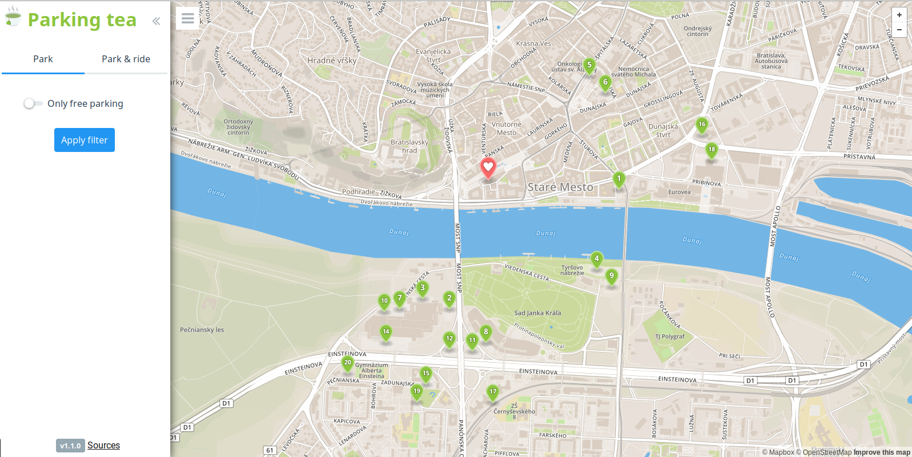

# Overview

This application shows parking in Bratislava on a map. Most important features are:
- show parking around selected point on the map
- park & ride - show you buses you can use to get to the target location from your parking

This is it in action:



The application has 2 separate parts, the client which is a [frontend web application](#frontend) using mapbox API and mapbox.js and the [backend application](#backend) written in [Flask](http://flask.pocoo.org/), backed by PostGIS. The frontend application communicates with backend using a [REST API](#api).

# Frontend

The frontend application is a static HTML page (`parking_tea/templates/index.html`), which shows a mapbox.js widget. It is displaying parkings, which are mostly in cities, thus the map style is `mapbox.streets`.

All relevant frontend code is in `main.js` and `map.js` which is referenced from `index.html`. The frontend code is very simple, its only responsibilities are:
- detecting user's location, using the standard [web location API](https://developer.mozilla.org/en-US/docs/Web/API/Geolocation/Using_geolocation)
- displaying the sidebar panel with filtering controls, driving the user interaction and calling the appropriate backend APIs
- displaying markers with custom popups

# Backend

The backend application is written in Flask (Python web framework) and is responsible for querying geo data, formatting the geojson and data for the sidebar panel. SQL queries are placed in separated files in Jinja2 templates format.

## Data

Data about parking and bus stops is coming directly from Open Street Maps. I downloaded an extent covering whole Slovakia (around 300MB) and imported it using the `osm2pgsql` tool into the standard OSM schema in WGS 84 with hstore enabled. GeoJSON is generated by using a standard `st_asgeojson` function.

## Api

**Find nearest parking**

`GET /api/v1/parking/17.106914520263675/48.14089063959608/?filter_area_size=500&filter_min_capacity=0&filter_only_free=false`

**Find parking and buses**

`GET /api/v1/park_and_ride/17.106914520263675/48.14089063959608/`

### Response

API calls return json responses with array of objects describing parking. Field `transfers` holds bus numbers:
```
{
    "coordinates": "{\"type\":\"Point\",\"coordinates\":[17.1039401513826,48.1344312361878]}",
    "bus_stop_start": "Most SNP",
    "bus_stop": "Aupark",
    "tags": {
      "supervised": "yes",
      "opening_hours": "24/7",
      "park_ride": "bus",
      "fee": "yes",
      "parking": "surface"
    },
    "transfers": [
      "191"
    ],
    "area": 13491.5,
    "duration": 0,
    "type": "polygon",
    "name": "",
    "distance": 751.581648038
  }
```
